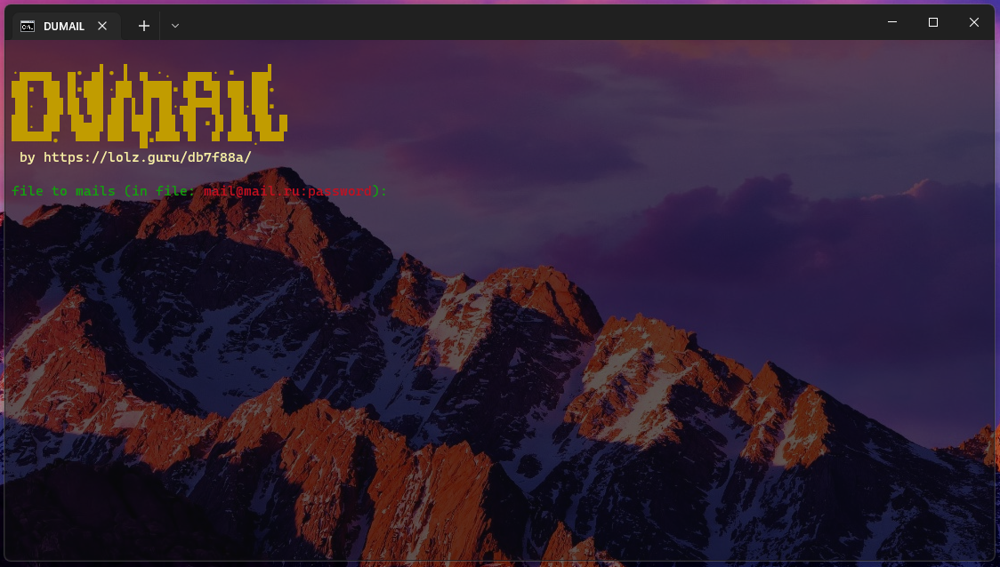

    Dump Mail - Дамп всех писем через imap     
    
- Скорость
- Понятность
---
    Инструкция
- Установить Python 3.9
- Запустить файл install_libs.cmd
- Собрать список почт в виде: example@mail.ru:password, у почт обязательно должен быть включён доступ по протоколу IMAP (доступ к почте с помощью других клиентов по протоколу IMAP)
- Запустить start.cmd
---
    